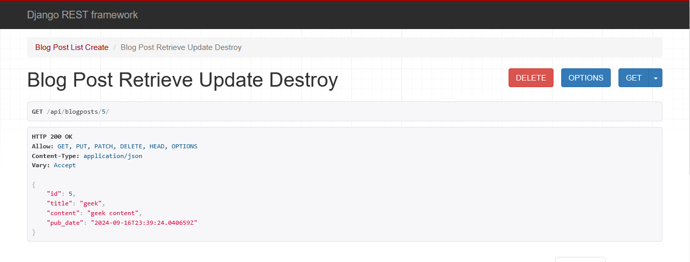

# Blog Rest API
This is a simple Rest API that enables a client to perform Create, Read, Update and Delete operations.
## For use please follow the instructions below:
- Ensure you have python 3 installed.
- Create virtual environment by running `python -m venv env` in your command prompt or powershell.
- Activate virtual environment by running `env\scripts\activate`.
- Install django by running `pip install django`.
- Install Django Restframework by running `pip install djangorestframework`.
- Prepare database migrations by running `python manage.py makemigrations`.
- Make the database migrations by running `python manage.py migrate`.
- Run the server by typing `python manage..py runserver`.

If you followed the above steps correctly you should be presented with a localhost url.
- Copy and paste this URL in your browser
- Append api/blogposts to the base url. Example: 1.2.7.001:8000/api/blogposts
- If done correctly this should open up and present to you all blogposts in the database as JSON

## Endpoints Documentation
- `api/blogposts`: This endpoint returns all blogposts availabe with their title, content and published_date attributes.
- `api/blogposts/<id>`: This endpoint will serve for retrival, update and Deletion operations. To use ensure to place the id of the blogpost you intend to work with in the `<id>` placeholder.
    - For retrieval: Once the request is sent the API will return the blogpost with that id, the title, content and published_date.
    - For Update: You may attach a JSON object with the new attributes of the blogpost you want to update before sending the request. The API would return the updated value of the blogpost if succesful. Example of JSON object to send `{"title": "Fishing on a farm", content="Once upon a time..."}`

- `api/blogposts/search/<title>`: This endpoint allows for search functionality. You can search blogposts by title through this endpoint replacing the title placeholder with what you want to search for. It will return all the blogposts with that search title in its own title attribute.

- `api/blogposts/create`: This endpoint enables creation of blogposts. Attach a JSON object containing the title and content of the blogpost. Example: `{"title": "How to Fish", content="Before one can succesfully fish..."}`

Be sure to reach out on [X](https://github.com/Ndigitals001) if you have any inquiry or want to make a contribution.

    